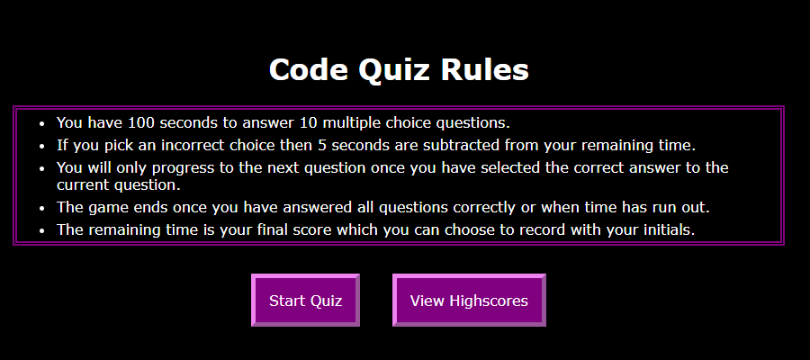
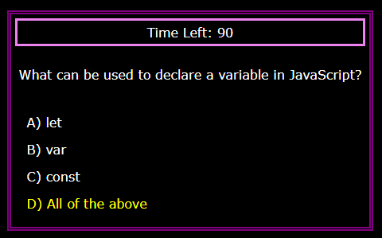
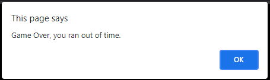

# Code-Quiz
This code quiz asks multiple choice questions about JavaScript fundamentals. The quiz is timed and the users remaining time can be recorded.

## Features:
```
The user is first presented with the quiz rules and options to start the quiz or view highscores. A timer starts once the first question is shown. The user is only able to go to the next question once they have selected the correct answer with incorrect answers resulting in a time penalty. The quiz ends once all questions have been answered or the user runs out of time. If all questions are answered, the user is asked if they would want to record their score and initials. The recorded score can be deleted while viewing the high scores.
```

## Screenshots:

```
Starting page displays rules of the quiz and buttons to start quiz or view highscores.
```

```
Quiz displays the timer, a question and four choices, the color of the choice changes if the user hovers over it.
```

```
The user is alerted once time has run out.
```

```
The user is asked to enter initials if they choose to do so after completing the quiz.
```
Link to application: https://ronarceo.github.io/Code-Quiz/